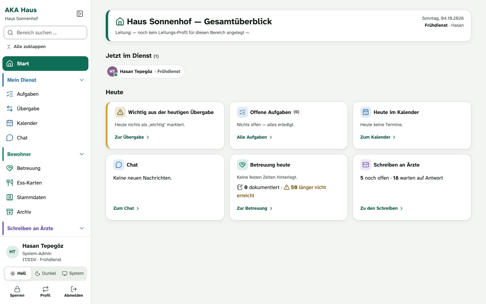
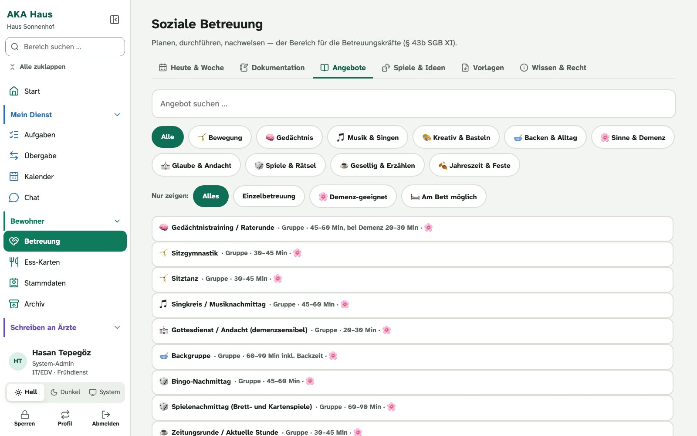
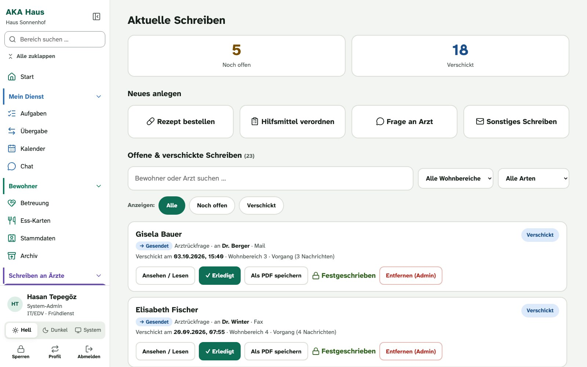
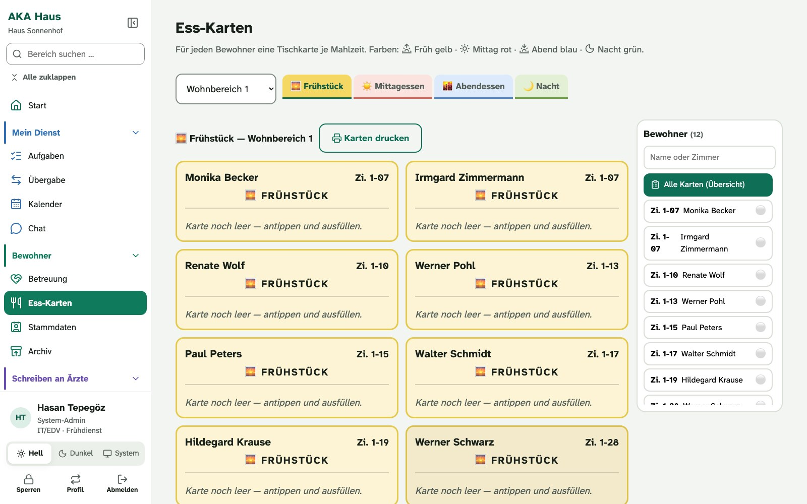
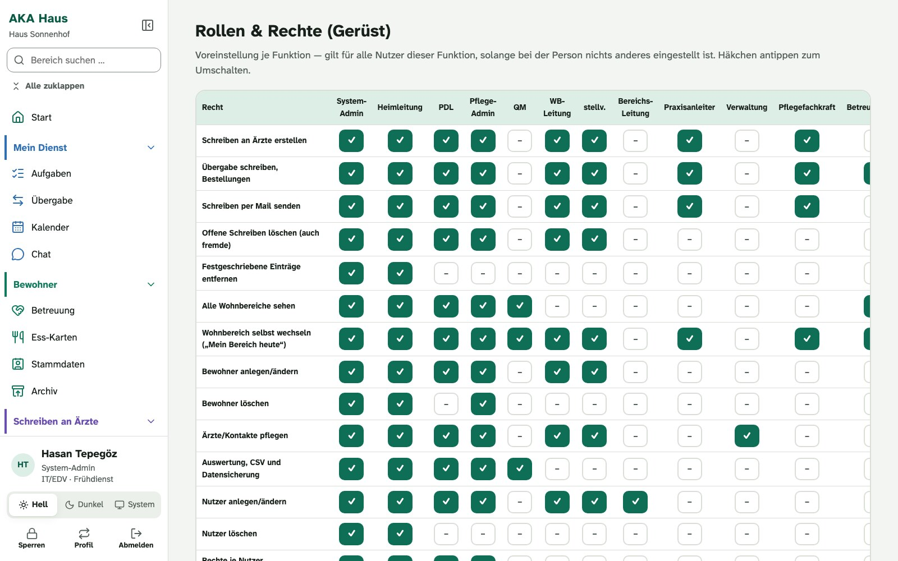
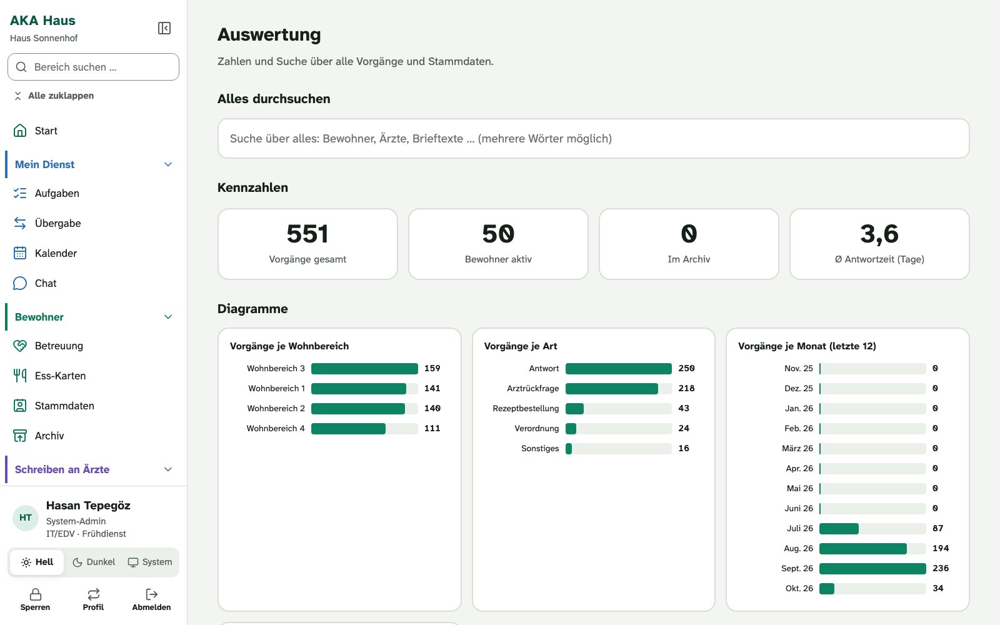
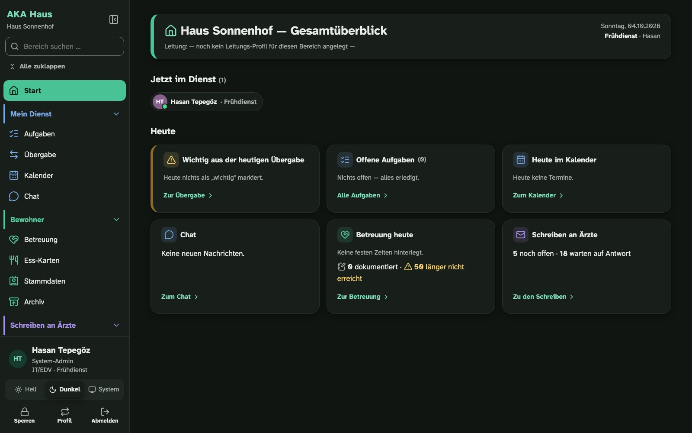

  

<h1 align="center">AKA Haus</h1>

  Organisation und Kommunikation im Pflegeheim. 
  Eigenständig neben jeder Pflegesoftware. Läuft nur im Hausnetz.

  <b>Stand: in Entwicklung</b> · Vorführung und Anfragen: <a href="mailto:info@mika-tec.com">info@mika-tec.com</a> 
  Website: <a href="https://mika-tec.com/aka-haus.html">mika-tec.com/aka-haus.html</a>

> [!NOTE]
> Dieses Repository ist ein Schaufenster. Es enthält die Beschreibung und die Bilder, nicht den Programmcode.
> AKA Haus ist ein Produkt von MikaTec und wird nicht frei verteilt. Alle Bilder zeigen eine Übungsversion mit erfundenen Daten.

## Wofür AKA Haus da ist

Pflegesoftware wie MediFox, Vivendi oder SENSO konzentriert sich auf die Pflegedokumentation. Vieles, was im Heim daneben anfällt, läuft heute auf Papier, über Zettel am Dienstzimmer oder gar nicht: der Wochenplan der Betreuung, die Rückfrage an die Arztpraxis, die Temperaturliste am Kühlschrank, die Meldung an die Haustechnik, der Aushang für alle.

Genau das deckt AKA Haus ab. Es ersetzt die Pflegesoftware nicht, es arbeitet daneben. Es braucht keine Schnittstelle zu ihr und funktioniert deshalb mit jedem Hersteller.

## Was es kann

| Bereich | Inhalt |
| --- | --- |
| **Betreuung** | Wochenplan, Angebote nach Art und Eignung, Spiele und Übungen, Vorlagen zum Drucken, Nachweise nach § 43b SGB XI |
| **Schreiben an Ärzte** | Rezepte und Hilfsmittel anfordern, Rückfragen stellen, Nachverfolgung bis zur Antwort, Ausgabe als PDF |
| **Protokolle** | Kühlschrank-Temperaturen, Schlüsselübergabe, festgeschrieben mit Name und Uhrzeit |
| **Haustechnik und Wartung** | Defekte melden, Schlüssel und Geräte, Prüfungen und Schulungen mit Erinnerung |
| **Qualität** | Dokumente, Beschwerden und Ideen, Formulare |
| **Miteinander** | Chat, Kalender, Übergabe, Schwarzes Brett, Telefonbuch, Ess-Karten |
| **Leitung** | Auswertung, Rollen und Rechte nach Bereich, Funktion und Dienst |

Jedes Heim kann einzelne Bereiche abschalten.

## Bilder

| | |
| --- | --- |
|  **Betreuung:** Angebote nach Art, Dauer und Eignung |  **Schreiben an Ärzte:** offen, verschickt, festgeschrieben |
|  **Ess-Karten:** eine Tischkarte je Bewohner und Mahlzeit |  **Rollen und Rechte:** wer was sehen und ändern darf |
|  **Auswertung:** Zahlen und Suche über alle Vorgänge |  **Hell und dunkel:** jede Ansicht in beiden Darstellungen |

## Die Daten bleiben im Haus

Es geht um Gesundheitsdaten. Deshalb gilt für AKA Haus: Sicherheit vor Funktion. Nach diesen Grundsätzen wird gebaut:

- **Server im Heim.** Ein kleiner eigener Server steht im Haus. Es gibt keine Cloud und keine Weiterleitung ins Internet.
- **Keine fremden Dienste.** Keine Daten von Bewohnern oder Mitarbeitern gehen an Dritte, auch nicht für Rechtschreibprüfung, Übersetzung oder KI.
- **Verschlüsselt, auch im Haus.** Die Verbindung zwischen Gerät und Server ist verschlüsselt, Sicherungen ebenfalls.
- **Rechte prüft der Server.** Anmeldung und Berechtigungen werden auf dem Server geprüft, nicht nur in der Oberfläche.
- **Einziger Weg nach außen:** Schreiben an Arztpraxen per Mail oder Fax, über den Mailserver des Heims, und abschaltbar.

AKA Haus ist kein Medizinprodukt. Es rechnet keine Dosierungen und bewertet keine Risiken.

## Auf welchen Geräten

Eine Anwendung für alle Geräte im Haus: im Browser am PC und als App auf dem iPad. Ein eigenes Programm für macOS und Windows ist in Arbeit.

## Stand

AKA Haus ist in Entwicklung und arbeitet bisher ausschließlich mit Übungsdaten. Es ist noch nicht im Echtbetrieb.

| Schritt | Stand |
| --- | --- |
| Bereiche und Oberfläche, hell und dunkel | gebaut |
| Server im Heim: Anmeldung, Rechte, Echtzeit, verschlüsselte Sicherungen | gebaut, letzte Teile in Arbeit |
| Betreuung weiter ausbauen | geplant |
| Datenschutz-Unterlagen und Installationspaket | geplant |
| Pilotbetrieb in einem Haus | geplant |

## Interesse?

AKA Haus gibt es nicht zum Herunterladen. Wer es kennenlernen möchte, bekommt eine Vorführung mit der Übungsversion.

**MikaTec** · [info@mika-tec.com](mailto:info@mika-tec.com) · [mika-tec.com](https://mika-tec.com)

Gesucht sind auch Rückmeldungen aus der Praxis: Was fehlt im Alltag eines Heims neben der Pflegesoftware am meisten?

## Rechte

© MikaTec. Alle Rechte vorbehalten. Texte und Bilder dieses Repositorys dürfen nicht ohne Zustimmung weiterverwendet werden. Genannte Produktnamen sind Marken ihrer Inhaber und dienen nur der Einordnung.

English

 

**AKA Haus** is an organisation and communication app for nursing homes. It runs alongside any nursing documentation software and covers what usually stays on paper: activity planning, letters to doctors, logs, maintenance, quality documents, tasks, chat, calendar and handover. It runs only inside the home's own network, on a small server in the building. No cloud, no third-party services.

This repository is a showcase without source code. The product is in development and currently works with practice data only. For a demonstration, contact [info@mika-tec.com](mailto:info@mika-tec.com).

